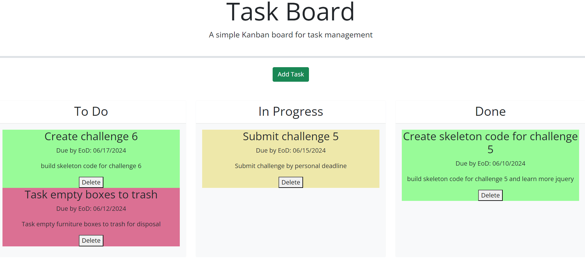

# To Do List Application

## Description
A todo list for scheduling projects and tracking deadlines.

## Instructions for Use
Click the "Add Task" button to open a form for creating aspects of a task. After clicking the "Add Task" button on the form, the site will generate a card that you can drag and drop. The task cards will change color depending on the status of the deadline.

Legend

Green - More than 1 day left on task deadline
Yellow - Less than 1 day remaining for task deadline
Red - Past task due date

## Link to Deployed Application
https://shermanburwell3.github.io/todo-list-application/

## Screenshot

## Credits
For jquery events such as hide(), I used code from w3schools.
link: https://www.w3schools.com/jquery/jquery_events.asp

For removing attributes from html elements I used the jquery API.
link: https://api.jquery.com/removeAttr/

HTML for modal provided to me by Krystal Stanton
link: https://github.com/bldambtn/Tasks_I_DontWantToDoBoard

Troubleshooting issue with dragging and dropping cards into other categories.
link: https://stackoverflow.com/questions/14725402/jquery-sortable-connectwith-dont-work

Update event on sortable was possible thanks to Gooks for Geeks
link: https://www.geeksforgeeks.org/jquery-ui-sortable-update-event/

A lot of code was tweaked by Xpert Learning Assistant on bootcampspot.
link: https://bootcampspot.instructure.com/courses/5313/external_tools/313